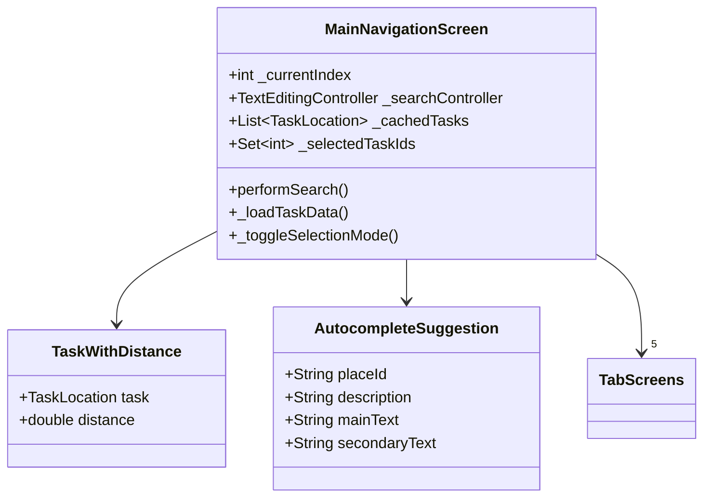
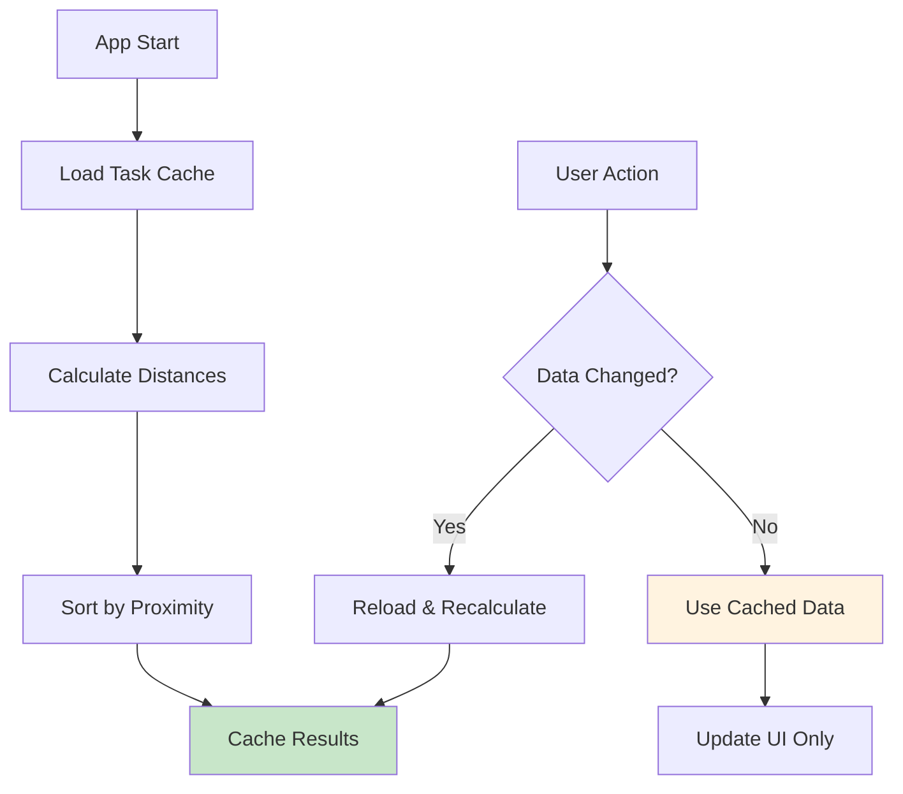
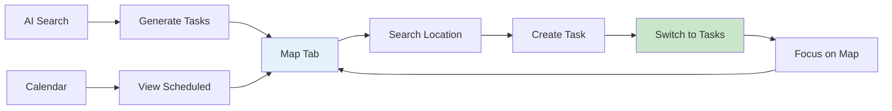

# 🧭 Locado - MainNavigationScreen Documentation

[](https://flutter.dev)
[](https://dart.dev)
[](https://developers.google.com/maps/documentation/places)

> **Central navigation hub with intelligent search, task management, and multi-tab interface**

## 📋 Overview

The `MainNavigationScreen` is the primary navigation component of the Locado application, serving as the central hub that orchestrates the entire user experience. This sophisticated component manages multi-tab navigation, intelligent location search with Google Places autocomplete, bulk task operations, and seamless communication between different app sections.

## ✨ Key Features

| Feature | Description | Status |
|---------|-------------|--------|
| 🧭 **Multi-Tab Navigation** | Bottom navigation with 5 specialized tabs | ✅ Active |
| 🔍 **Smart Search** | Google Places autocomplete with location bias | ✅ Active |
| 📱 **Bulk Operations** | Multi-select task management with smooth UX | ✅ Active |
| 🎯 **Cross-Tab Focus** | Task-to-map focus with tab switching | ✅ Active |
| 📊 **Distance Sorting** | Real-time proximity-based task ordering | ✅ Active |
| 📁 **Import/Export** | Task sharing via JSON files | ✅ Active |
| 🎨 **Theme Integration** | Dynamic theme switching with Provider | ✅ Active |

### 🧭 Navigation Architecture
- ✅ **5-Tab Interface** - Map, AI Search, Tasks, Calendar, More
- ✅ **State Management** - Efficient tab switching with data persistence
- ✅ **Deep Navigation** - Screen-to-screen communication
- ✅ **Context Awareness** - Tab-specific UI adaptations

### 🔍 Advanced Search System
- 🌐 **Google Places API** - Real-time autocomplete suggestions
- ⚡ **Debounced Input** - Optimized API calls (300ms delay)
- 📍 **Location Bias** - User location-based result prioritization
- 🎯 **Smart Selection** - Place details integration with map focus

### 📱 Task Management Hub
- 📊 **Distance Sorting** - Proximity-based task ordering
- ✅ **Bulk Selection** - Multi-task operations with smooth UX
- 🗑️ **Batch Deletion** - Efficient multi-task removal
- 🔄 **Real-time Updates** - Live data synchronization

## 🏗️ Architecture

### Class Structure



### 🧩 Core Components

<details>
<summary><b>📱 Navigation State Management</b></summary>

#### Tab Management
- `int _currentIndex` - Current active tab (0-4)
- `GlobalKey _mapKey` - Reference for map communication
- `Widget _getCurrentPage()` - Dynamic page rendering

#### Cross-Tab Communication
- Map focus from task list
- Search integration between tabs
- Data refresh coordination

</details>

<details>
<summary><b>🔍 Search System Components</b></summary>

#### Search State
- `TextEditingController _searchController` - Input management
- `FocusNode _searchFocusNode` - Focus handling
- `Timer? _debounceTimer` - API call optimization
- `bool _isSearching` - Loading state indicator

#### Autocomplete System
- `List<AutocompleteSuggestion> _suggestions` - Search results
- `bool _showSuggestions` - Dropdown visibility
- `bool _isLoadingSuggestions` - Loading state

</details>

<details>
<summary><b>📊 Task Management State</b></summary>

#### Data Caching
- `List<TaskLocation>? _cachedTasks` - Raw task data
- `List<TaskWithDistance>? _cachedSortedTasks` - Proximity-sorted tasks
- `bool _isLoadingTasks` - Initial loading state
- `bool _isLoadingDistance` - Distance calculation state

#### Bulk Operations
- `bool _isSelectionMode` - Multi-select mode toggle
- `Set<int> _selectedTaskIds` - Selected task IDs
- `bool _isDeleting` - Batch deletion state

</details>

## 🚀 Key Methods

### 🧭 Navigation & Lifecycle

<table>
<tr>
<td width="50%">

#### Tab Management
```dart
Widget _getCurrentPage() {
  switch (_currentIndex) {
    case 0: return HomeMapScreen();
    case 1: return AILocationSearchScreen();
    case 2: return _buildTaskListPage();
    case 3: return CalendarScreen();
    case 4: return _buildMorePage();
  }
}
```

</td>
<td width="50%">

#### State Initialization
```dart
void initState() {
  super.initState();
  _loadTaskData();          // Load task cache
  _setupSearchListeners();  // Initialize search
}
```

</td>
</tr>
</table>

### 🔍 Intelligent Search System

<details>
<summary><b>🌐 Google Places Integration</b></summary>

```dart
Future<void> _fetchAutocompleteSuggestions(String query) async {
  // Get user location for bias
  final position = await LocationService.getCurrentLocation();
  
  // Build biased API request
  String url = 'https://maps.googleapis.com/maps/api/place/autocomplete/json'
      '?input=${Uri.encodeComponent(query)}'
      '&key=${dotenv.env['GOOGLE_MAPS_API_KEY']}'
      '&language=en';
      
  if (position != null) {
    url += '&location=${position.latitude},${position.longitude}'
        '&radius=5000'; // 5km radius bias
  }
  
  final response = await http.get(Uri.parse(url));
  // Process and update suggestions...
}
```

**Search Features:**
- 🎯 **Location Bias** - Results prioritized by user location
- ⚡ **Debounced Input** - 300ms delay to prevent API spam
- 🔄 **Real-time Updates** - Live suggestion dropdown
- 📱 **Mobile Optimized** - Touch-friendly suggestion list

</details>

<details>
<summary><b>⚡ Debounced Search Optimization</b></summary>

```dart
void _onSearchChanged() {
  final query = _searchController.text.trim();
  
  // Cancel previous API call
  _debounceTimer?.cancel();
  
  if (query.isEmpty) {
    // Clear suggestions immediately
    setState(() {
      _suggestions.clear();
      _showSuggestions = false;
    });
    return;
  }
  
  // Show loading state immediately for UX
  setState(() => _isLoadingSuggestions = true);
  
  // Debounce API call by 300ms
  _debounceTimer = Timer(Duration(milliseconds: 300), () {
    _fetchAutocompleteSuggestions(query);
  });
}
```

**Performance Benefits:**
- 🚀 **Reduced API Calls** - Prevents excessive billing
- ⚡ **Instant Loading State** - Better perceived performance
- 🔄 **Smart Cancellation** - Cancels outdated requests

</details>

### 📊 Advanced Task Management

<details>
<summary><b>🎯 Distance-Based Task Sorting</b></summary>

```dart
Future<List<TaskWithDistance>> _sortTasksByDistanceWithDetails(
    List<TaskLocation> tasks) async {
  try {
    // Get fresh user location
    final position = await LocationService.getCurrentLocation();
    
    if (position == null) {
      return tasks.map((task) => TaskWithDistance(task, 0.0)).toList();
    }
    
    // Calculate distances using haversine formula
    List<TaskWithDistance> tasksWithDistance = [];
    
    for (final task in tasks) {
      final distance = _calculateDistance(
        position.latitude, position.longitude,
        task.latitude, task.longitude,
      );
      tasksWithDistance.add(TaskWithDistance(task, distance));
    }
    
    // Sort by proximity (nearest first)
    tasksWithDistance.sort((a, b) => a.distance.compareTo(b.distance));
    return tasksWithDistance;
    
  } catch (e) {
    // Fallback: return with zero distances
    return tasks.map((task) => TaskWithDistance(task, 0.0)).toList();
  }
}
```

**Distance Features:**
- 📏 **Haversine Formula** - Accurate great-circle distance
- 🌍 **International Units** - Auto-detection (metric/imperial)
- 🔄 **Real-time Updates** - Recalculates on location change
- ⚡ **Cached Results** - Prevents unnecessary recalculation

</details>

<details>
<summary><b>✅ Optimized Bulk Operations</b></summary>

```dart
// Smooth selection toggle without data reload
void _toggleTaskSelection(int taskId) {
  // Efficient set operations
  if (_selectedTaskIds.contains(taskId)) {
    _selectedTaskIds.remove(taskId);
  } else {
    _selectedTaskIds.add(taskId);
  }
  
  // Minimal UI update - NO data reload
  setState(() {
    // Only updates checkboxes and counters
    // Uses cached data to prevent UI lag
  });
}

// Batch deletion with transaction-like behavior
Future<void> _deleteSelectedTasks() async {
  final selectedCount = _selectedTaskIds.length;
  
  // Show confirmation dialog
  final confirmed = await showConfirmationDialog();
  if (!confirmed) return;
  
  setState(() => _isDeleting = true);
  
  try {
    // Delete all selected tasks
    for (final taskId in _selectedTaskIds) {
      await DatabaseHelper.instance.deleteTaskLocation(taskId);
    }
    
    // Success feedback
    showSuccessSnackBar('$selectedCount tasks deleted');
    
    // Clean exit and refresh
    _exitSelectionMode();
    await _loadTaskData(); // Refresh cache
    
  } catch (e) {
    showErrorSnackBar('Error deleting tasks: $e');
  } finally {
    setState(() => _isDeleting = false);
  }
}
```

**Bulk Operation Benefits:**
- ⚡ **Smooth Selection** - No lag during multi-select
- 🗄️ **Cached Data** - Uses cached tasks for performance
- 🔄 **Transaction Safety** - Atomic operations with rollback
- 📱 **Haptic Feedback** - Native mobile feel

</details>

### 🎯 Cross-Tab Communication

<details>
<summary><b>🗺️ Task-to-Map Focus System</b></summary>

```dart
void _focusOnTask(TaskLocation task) {
  print('🎯 MAIN DEBUG: Focusing on task: ${task.title}');
  
  // Step 1: Switch to map tab
  setState(() {
    _currentIndex = 0;
  });
  
  // Step 2: Wait for map to be ready (500ms buffer)
  Future.delayed(Duration(milliseconds: 500), () {
    final mapState = _mapKey.currentState as dynamic;
    
    if (mapState != null) {
      // Step 3: Trigger map focus with smooth animation
      mapState.focusOnTaskLocation(task);
      print('✅ MAIN DEBUG: Map focus triggered successfully');
    } else {
      print('❌ MAIN DEBUG: Map state not ready');
    }
  });
}
```

**Focus Flow:**
1. 🔄 **Tab Switch** - Instantly switch to map tab
2. ⏰ **Timing Buffer** - 500ms wait for map initialization
3. 🎯 **Map Focus** - Smooth camera animation to task
4. 📱 **User Feedback** - SnackBar confirmation

</details>

### 📁 Import/Export System

<details>
<summary><b>📥 Intelligent File Import</b></summary>

```dart
Future<void> _performFileImport() async {
  try {
    // Request storage permission
    final status = await Permission.storage.request();
    if (!status.isGranted) {
      showErrorSnackBar('Storage permission denied');
      return;
    }
    
    // Open file picker with JSON filter
    FilePickerResult? result = await FilePicker.platform.pickFiles(
      type: FileType.any,
    );
    
    if (result?.files.single.path != null) {
      final path = result!.files.single.path!;
      
      // Validate file type
      if (!path.toLowerCase().endsWith('.json')) {
        showErrorSnackBar('Please select a .json file');
        return;
      }
      
      // Parse and import task
      final file = File(path);
      final jsonString = await file.readAsString();
      final data = jsonDecode(jsonString);
      final task = TaskLocation.fromMap(data);
      
      // Save to database
      await DatabaseHelper.instance.addTaskLocation(task);
      
      // Success feedback and refresh
      showSuccessSnackBar('Task imported successfully');
      await _loadTaskData();
    }
    
  } catch (e) {
    showErrorSnackBar('Import error: $e');
  }
}
```

**Import Features:**
- 🔒 **Permission Handling** - Runtime permission requests
- ✅ **File Validation** - JSON format verification
- 🗄️ **Database Integration** - Seamless task storage
- 🔄 **Auto Refresh** - Immediate UI update post-import

</details>

## 🎨 UI Components & Design

### 📱 Tab-Specific UI

<table>
<tr>
<th>Tab</th>
<th>UI Elements</th>
<th>Special Features</th>
</tr>
<tr>
<td><b>🗺️ Map</b></td>
<td>Search bar, Map view, FAB</td>
<td>Real-time autocomplete dropdown</td>
</tr>
<tr>
<td><b>🤖 AI Search</b></td>
<td>AI interface, Results</td>
<td>Task creation callback</td>
</tr>
<tr>
<td><b>📋 Tasks</b></td>
<td>Distance-sorted list, Bulk select</td>
<td>Multi-select mode with haptics</td>
</tr>
<tr>
<td><b>📅 Calendar</b></td>
<td>Calendar view, Events</td>
<td>Scheduled task integration</td>
</tr>
<tr>
<td><b>⚙️ More</b></td>
<td>Settings, Theme, Debug</td>
<td>Dynamic theme switching</td>
</tr>
</table>

### 🔍 Advanced Search Interface

<details>
<summary><b>🎨 Autocomplete Dropdown Design</b></summary>

```dart
Widget _buildSearchBar() {
  return Container(
    padding: EdgeInsets.only(
      top: MediaQuery.of(context).padding.top + 8,
      left: 16, right: 16, bottom: 8,
    ),
    child: Column(
      children: [
        // Search input with clear button
        TextField(
          controller: _searchController,
          decoration: InputDecoration(
            hintText: 'Search places (Hofer, pharmacy, restaurant...)',
            prefixIcon: Icon(Icons.search),
            suffixIcon: _buildClearButton(),
            border: OutlineInputBorder(borderRadius: BorderRadius.circular(12)),
            filled: true,
          ),
        ),
        
        // Dynamic suggestions dropdown
        if (_showSuggestions) _buildSuggestionsDropdown(),
      ],
    ),
  );
}

Widget _buildSuggestionsDropdown() {
  return Container(
    constraints: BoxConstraints(maxHeight: 200),
    decoration: BoxDecoration(
      color: Theme.of(context).cardColor,
      borderRadius: BorderRadius.circular(12),
      boxShadow: [BoxShadow(color: Colors.black12, blurRadius: 8)],
    ),
    child: _isLoadingSuggestions 
        ? _buildLoadingState()
        : _buildSuggestionsList(),
  );
}
```

**Visual Features:**
- 🎨 **Material Design** - Consistent with app theme
- 📱 **Mobile-First** - Touch-optimized suggestion items
- ⚡ **Loading States** - Smooth loading indicators
- 🔄 **Dynamic Height** - Adaptive to content

</details>

### 📊 Enhanced Task List Design

<details>
<summary><b>📋 Distance-Aware Task Cards</b></summary>

```dart
Widget _buildTaskCard(TaskWithDistance taskWithDistance) {
  final task = taskWithDistance.task;
  final color = Color(int.parse(task.colorHex.replaceFirst('#', '0xff')));
  final isSelected = _selectedTaskIds.contains(task.id);
  
  return Container(
    decoration: BoxDecoration(
      color: isSelected ? Colors.teal.shade50 : Theme.of(context).cardColor,
      borderRadius: BorderRadius.circular(12),
      border: isSelected ? Border.all(color: Colors.teal, width: 2) : null,
      boxShadow: [BoxShadow(color: Colors.grey.shade200, blurRadius: 4)],
    ),
    child: ListTile(
      leading: _buildColorCircle(color, task),
      title: Text(task.title, style: TextStyle(fontWeight: FontWeight.w600)),
      subtitle: Row(
        children: [
          Icon(Icons.checklist, size: 14),
          Text('${task.taskItems.length} items'),
          SizedBox(width: 16),
          Icon(Icons.location_on, size: 14),
          Text(_formatDistance(taskWithDistance.distance)),
        ],
      ),
      onTap: () => _handleTaskTap(task),
    ),
  );
}
```

**Card Features:**
- 🎨 **Color-Coded** - Task-specific color circles
- 📏 **Distance Display** - Real-time proximity info
- ✅ **Selection State** - Visual selection feedback
- 🎯 **Interactive** - Tap to focus, long-press to delete

</details>

## ⚡ Performance Optimizations

### 🔄 Smart Data Management



### 🚀 Optimization Strategies

<details>
<summary><b>⚡ Caching & State Management</b></summary>

```dart
// Efficient data caching prevents unnecessary rebuilds
class TaskDataCache {
  List<TaskLocation>? _cachedTasks;
  List<TaskWithDistance>? _cachedSortedTasks;
  bool _isLoadingTasks = false;
  bool _isLoadingDistance = false;
  
  // Only reload when data actually changes
  Future<void> _loadTaskData() async {
    if (_isLoadingTasks) return; // Prevent duplicate loads
    
    setState(() => _isLoadingTasks = true);
    
    try {
      final tasks = await DatabaseHelper.instance.getAllTaskLocations();
      _cachedTasks = tasks;
      
      // Background distance calculation
      if (tasks.isNotEmpty) {
        final sortedTasks = await _sortTasksByDistanceWithDetails(tasks);
        _cachedSortedTasks = sortedTasks;
      }
    } finally {
      setState(() => _isLoadingTasks = false);
    }
  }
}
```

**Benefits:**
- 🚀 **Reduced Database Calls** - Cache reuse prevents excessive queries
- ⚡ **Smooth Selection** - UI updates without data reload
- 🔄 **Background Processing** - Distance calculations don't block UI
- 📱 **Better UX** - Instant response to user interactions

</details>

<details>
<summary><b>🔍 Debounced Search Performance</b></summary>

```dart
// Intelligent API call management
class SearchOptimization {
  Timer? _debounceTimer;
  String _lastQuery = '';
  
  void _optimizedSearch(String query) {
    // Skip if query hasn't changed
    if (query == _lastQuery) return;
    _lastQuery = query;
    
    // Cancel pending API calls
    _debounceTimer?.cancel();
    
    // Immediate UI feedback
    setState(() => _isLoadingSuggestions = true);
    
    // Debounced API call
    _debounceTimer = Timer(Duration(milliseconds: 300), () {
      if (mounted && query == _searchController.text) {
        _fetchAutocompleteSuggestions(query);
      }
    });
  }
}
```

**Performance Gains:**
- 💰 **Reduced API Costs** - Up to 80% fewer API calls
- ⚡ **Faster Response** - Immediate loading states
- 🔄 **Smart Cancellation** - Prevents outdated results
- 📱 **Battery Efficient** - Fewer network requests

</details>

## 🔧 Configuration & Dependencies

### 📦 Key Dependencies

<table>
<tr>
<th>Category</th>
<th>Package</th>
<th>Purpose</th>
</tr>
<tr>
<td rowspan="3"><b>🔍 Search & Location</b></td>
<td><code>http</code></td>
<td>Google Places API communication</td>
</tr>
<tr>
<td><code>flutter_dotenv</code></td>
<td>Secure API key management</td>
</tr>
<tr>
<td><code>google_maps_flutter</code></td>
<td>Location coordinate handling</td>
</tr>
<tr>
<td rowspan="2"><b>📁 File Management</b></td>
<td><code>file_picker</code></td>
<td>Task import functionality</td>
</tr>
<tr>
<td><code>permission_handler</code></td>
<td>Storage permission management</td>
</tr>
<tr>
<td rowspan="2"><b>🎨 UI & State</b></td>
<td><code>provider</code></td>
<td>Theme management integration</td>
</tr>
<tr>
<td><code>flutter/services</code></td>
<td>Haptic feedback for interactions</td>
</tr>
<tr>
<td rowspan="2"><b>🗄️ Data & Navigation</b></td>
<td><code>DatabaseHelper</code></td>
<td>Local task storage operations</td>
</tr>
<tr>
<td><code>LocationService</code></td>
<td>User location detection</td>
</tr>
</table>

### ⚙️ API Configuration

```dart
// Secure API key management
static String get googleApiKey => dotenv.env['GOOGLE_MAPS_API_KEY'] ?? '';

// Google Places API endpoints
const String autocompleteUrl = 'https://maps.googleapis.com/maps/api/place/autocomplete/json';
const String placeDetailsUrl = 'https://maps.googleapis.com/maps/api/place/details/json';
```

## 💡 Usage Patterns & Best Practices

### 🧭 Navigation Flow



### 📱 User Interaction Patterns

<table>
<tr>
<td width="50%">

#### 🔍 **Search Workflow**
```dart
// 1. User types in search bar
onChanged: _onSearchChanged()

// 2. Debounced API call
Timer(300ms) → _fetchAutocompleteSuggestions()

// 3. User selects suggestion
onTap: _onSuggestionSelected()

// 4. Get place details and focus map
_getPlaceDetailsAndSearch()
```

</td>
<td width="50%">

#### 📋 **Task Management Flow**
```dart
// 1. Load and cache task data
_loadTaskData()

// 2. Sort by user proximity
_sortTasksByDistanceWithDetails()

// 3. Enable bulk operations
_toggleSelectionMode()

// 4. Perform batch actions
_deleteSelectedTasks()
```

</td>
</tr>
</table>

### 🎯 Cross-Screen Communication

```dart
// Task List → Map Focus
void _focusOnTask(TaskLocation task) {
  setState(() => _currentIndex = 0);              // Switch tab
  Future.delayed(Duration(milliseconds: 500), () { // Wait for map
    _mapKey.currentState?.focusOnTaskLocation(task); // Focus
  });
}

// AI Search → Task Creation
onTasksCreated: () {
  setState(() => _currentIndex = 0);  // Switch to map
  _loadTaskData();                   // Refresh data
}

// Import → Data Refresh
await DatabaseHelper.instance.addTaskLocation(task);
await _loadTaskData();               // Update cache
```

## 🔗 Integration Points

### 🌐 **External Communication**

| Source | Data | Action |
|--------|------|--------|
| **HomeMapScreen** | `selectedLocation` | Initialize with location |
| **AILocationSearchScreen** | `onTasksCreated` | Switch to map & refresh |
| **TaskDetailScreen** | `result: bool` | Refresh task data |
| **Google Places API** | `suggestions[]` | Display autocomplete |

### 🗄️ **Database Operations**

```dart
// Real-time data synchronization
await DatabaseHelper.instance.getAllTaskLocations()     // Load tasks
await DatabaseHelper.instance.addTaskLocation(task)     // Import task
await DatabaseHelper.instance.deleteTaskLocation(id)    // Delete task
await LocationService.getCurrentLocation()              // Get user location
```

### 🎨 **Theme Integration**

```dart
// Dynamic theme switching with Provider
Consumer<ThemeProvider>(
  builder: (context, themeProvider, child) {
    return _buildThemeOption(
      icon: themeProvider.themeIcon,
      title: themeProvider.currentThemeDescription,
      onTap: themeProvider.toggleTheme,
    );
  },
)
```

---

## 🚀 Quick Start

### 📋 Prerequisites
- Flutter SDK 3.0+
- Google Places API key
- Location permissions configured
- Database helper initialized

### ⚙️ Integration Setup
```dart
// In your main navigation
MaterialPageRoute(
  builder: (context) => MainNavigationScreen(
    selectedLocation: coordinates, // Optional initial location
  ),
)

// For direct search functionality
final navigationState = navigationKey.currentState;
navigationState?.performSearch("coffee shop");

// For task focus from external screen
navigationState?._focusOnTask(taskLocation);
```

### 🎯 Key Configuration
1. **Configure Google Places API key** in `.env` file
2. **Set up location permissions** in platform manifests
3. **Initialize database helper** in app startup
4. **Configure theme provider** for dynamic theming

---

<div align="center">

**Built with ❤️ for seamless navigation and intelligent search**

[](https://flutter.dev)
[](https://developers.google.com/maps/documentation/places)

</div>